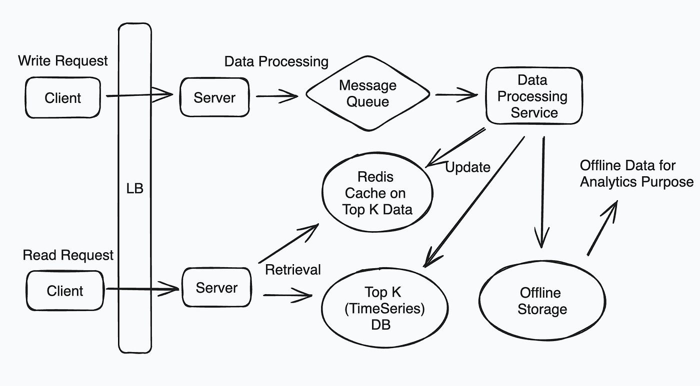

# Top K

## Requirement

### Functional Requirement

### Non-Functional Requirement

1. CAP Theroem
2. Low Latency

## Core Entities & APIs

### Core Entities

### APIs

## High Level Design

- Sorting = nlogn = cache(precompute data)
- Redis gives top k with nlogk
- Top K queries : Heap
- Counting : Count Min Sketch
- Handling time : Hopping

## Deep Dive

## 

## Links

- <https://medium.com/@bugfreeai/meta-mock-system-design-interview-top-k-request-analysis-system-8f181aa06e78>
- <https://systemdesignfightclub.com/spotify-top-K/>
- <https://serhatgiydiren.com/system-design-interview-top-k-problem-heavy-hitters/>
- <https://serhatgiydiren.com/tags/interview-prep/>
