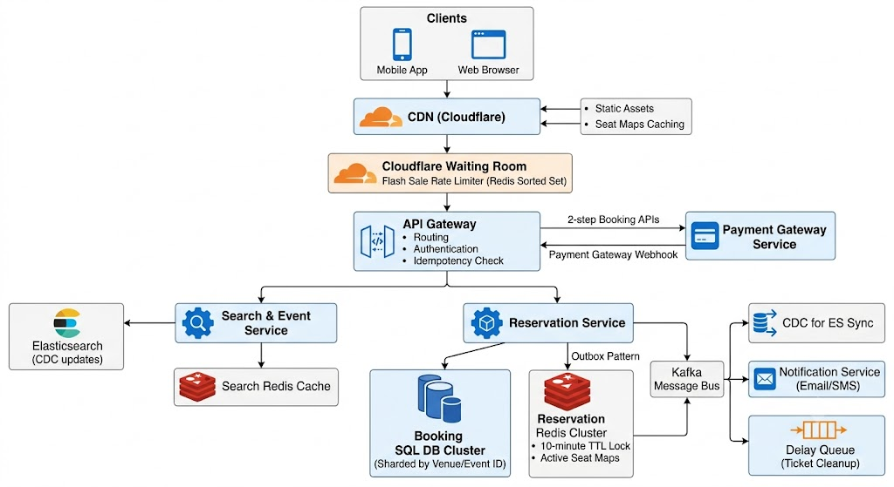

# Book My Show

## Requirement

### Functional Requirement

1. Book Ticket/ View Ticket
2. Search Event

### Non Functional Requirement

1. CAP Theorem
   - Consisitency >> Availability in Booking
   - Availability >> Consisitency in Search/View Events

2. Read Heavy System
3. Scalable in sudden surge of popular events.

## Core Entities & APIs

> > extract from functional requirement

### Core Entities

- Ticket, Event, Venue, Performer

### APIs

- getEvents()
- getEventsById()
- searchEvent()
- bookTicket() - 2 step process
  1. reserveticket()
  2. confirmticket()

## High Level Design

> > satisfy APIs

1. CRUD APIs

- getEvents()
- getEventsById()
- searchEvent()

> > select \* from table

1. Book Ticket

- AP1 : maintain different status and reserved time stamp in table, unblock ticket is status not changed to booking after 10 minutes.(complex data model and not scalble)
- AP2 : fixed crob job to cleanup status, tickets reseved in 12:09 wil exipry in 1 minute not 10 minutes
- AP3 : Distributed Lock with ttl (fail over) ; seat map -> fetch from db and filter in redis.

## Deep Dive

1. Low Latency : Elastic Search + CDC
2. Hotspot for popular query : Redis or MemCached
3. CDN Caching + Elastic Search Caching
4. Handle High Spike(booking 1st day ticket)
   1. Long Polling
   2. SSE
   3. Virtual Waiting Queue Enabled by Admin (Redis Sorted Set)
5. Scaling
   1. Sharding (shard by events), because of major queries.
   2. Distribute geo sharding by venue (so close venue fast)
6. High Read Load - Cache

## Back of Envelope

**Assumptions & Scale**

- **Scale:** 10 Million DAU | 20,000 Shows/day | 200 Seats/show
- **Read:Write Ratio:** 100:1 (Normal) | 1,000:1 (Flash Sale Spikes)

---

### Traffic Estimates (QPS)

- **Read Traffic (Search & View):**
- **Average:** ~1,200 QPS `[10M DAU × 10 views / 86,400s ≈ (100M / 10^5s)]`
- **Peak:** ~6,000 QPS `[1,200 Avg QPS × 5x peak factor]`

- **Write Traffic (Bookings):**
- **Average:** ~10 QPS `[10M DAU × 5% bookings / 86,400s ≈ (500K / 10^5s)]`
- **Peak (Flash Sale):** ~5,000 QPS `[500 bookings/sec per major show × 10 popular shows]`

---

### Storage Estimates

- **Daily Seat Inventory (Hot Data):** ~200 MB/day `[20K shows × 200 seats × 50 bytes ≈ (4M seats × 50B)]`
- **Booking Records:** ~500 MB/day `[500K bookings × 1 KB payload]`
- **5-Year Historical DB Storage:** ~1 TB `[500 MB/day × 365 days × 5 years ≈ (180 GB/yr × 5)]`

---

### Memory & Cache (Redis Hot Layer)

- **3-Day Active Seat Map Cache:** ~600 MB `[60K shows × 200 seats × 50 bytes]`
- **Total Redis Memory Needed (with Metadata):** ~16 GB `[600 MB seat cache + overhead/metadata margin]`

---

### Network Bandwidth

- **Peak Egress (Reads):** ~60 MB/s `[6,000 Peak Read QPS × 10 KB payload ≈ (60,000 KB/s)]`
- **Peak Ingress (Writes):** ~5 MB/s `[5,000 Peak Write QPS × 1 KB payload ≈ (5,000 KB/s)]`

---
