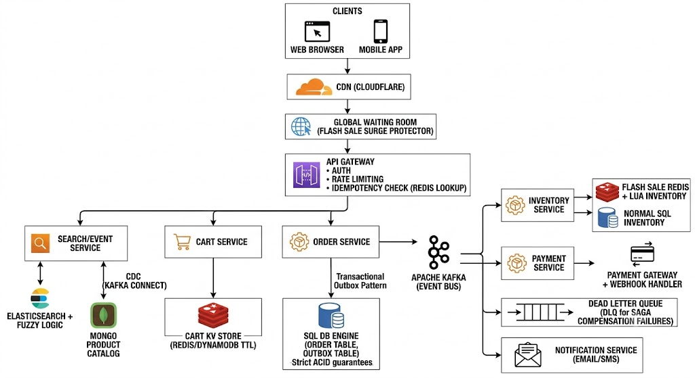

# Amazon

## Requirements

### Functional Requirement

1. Browser & View Products
2. Search by category, price.
3. Cart CRUD
4. Checkout payment and track order
5. Track stock level and prevent overselling

### Non-Functional Requirement

1. CAP Theoreom
   - Inventory and Order should be strong consistency
   - Order and Payment should be durable

## Core Entities & APIs

### Core Entities

- Products, Order, Cart

### APIs

- searchByProduct()
- getProductById()
- addToCart()
- placeOrder() with idempoteny key
- trackOrder()

## High Level Design

### Database & Service

1. Product Catelog - MongoDB &rarr; Product Service
2. Orders - SQL &rarr; Order Service
3. Inventory - SQL (Row level optimistic lock during normal days)/ Redis (While flash sale) &rarr; Inventory Service
4. Search - Elastic Search &rarr; Search Service

> > order table should have idempoteny key

## Deep Dive

1. Product Search &rarr; Elastic Search + CDC/Fuzzy logic for spelling mistake
2. Inventory & Prevent Overselling &rarr; Normal Shopping (Row level but have contention in peak traffic)/Flash Sell (Redis + Lua Script)
3. Order Processing &rarr; Sage Patten (local transaction + compensating action)

## 

Critical Missing Components to AddMissing ComponentArchitecture RoleKey BenefitCart Storage EngineEphemeral, high-throughput KV storeStoring active carts in SQL or Mongo creates unnecessary write amplification. Redis or DynamoDB (TTL-backed) is ideal for fast Cart CRUD.Payment Gateway & WebhooksAsync Payment OrchestrationDecouples order creation from payment confirmation; uses webhooks + idempotency keys to handle slow or dropped bank callbacks.Transactional Outbox PatternOrder Service $\rightarrow$ Message Bus (Kafka)Guarantees that updating the Order DB and publishing events (to Payment/Inventory/Notification services) happen atomically.Dead Letter Queue (DLQ)Compensation failure handlingCaptures failed Saga rollback actions (e.g., failed inventory release) so background workers or admins can remediate without losing state.
