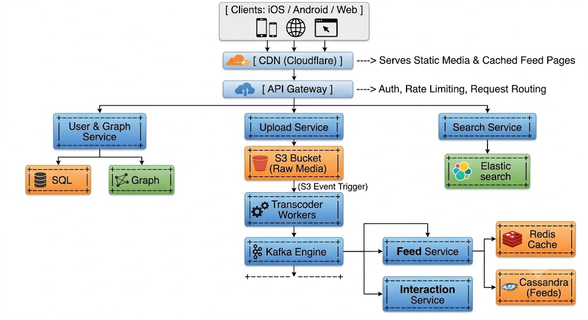

# Instagram

## Requirement

### Functional Requirement

1. upload post & interaction
2. user feed and search
3. social interfaction (like, comment, share)

### Non-Functional Requirement

1. CAP Theroem
   - Eventual Consistency for post delay
2. Durable uploads

## Core Entities & APIs

### Core Entities

- Post, User, Interaction

### APIs

- uploadPost(), fetchPost(), viewPost()
- followUser()
- likePost(), commentPost()
- searchUser()

## High Level Design

1. SQL - User, Post Metadata
2. Cassandra - denoemalised feed (pk: userid, ck:other_userid)
3. Elastic Search + CDC - Search
4. S3 - Blob(Media)

## Deep Dive

- Media Upload : s3
- Feed Generation : push for < 100 and pull for > 100
- Interaction : publish kafka since rapid request to server& Async database insert (no lose since repliaction factor/ack=all and commit lof)
- Search : Elastic Search
- Scalability : Sharding with consisteny hashing & Replication
- Availability + Durability : Replicas, Availability Zone, FailOver, Circuit Breaker

## 

---

Critical Missing Components to AddMissing ComponentArchitecture RoleKey BenefitMedia Processing Worker (Transcoder)Async S3 Trigger $\rightarrow$ Kafka $\rightarrow$ WorkerTranscodes uploaded videos into multiple resolutions (1080p, 720p, 480p) and generates image thumbnails.Read-Through Feed Cache (Redis)Cache layer in front of CassandraCaching the top 100–200 post IDs of active user feeds prevents heavy disk I/O on Cassandra for every app open.Counter Service (Redis / Cassandra)High-throughput likes/comments counterAvoids executing heavy COUNT(\*) queries on relational tables during viral post spikes.Graph DB or Graph ServiceSocial Graph (Followers/Following)Neo4j or a Redis-backed graph index handles complex social relationships and mutual friend checks efficiently.
