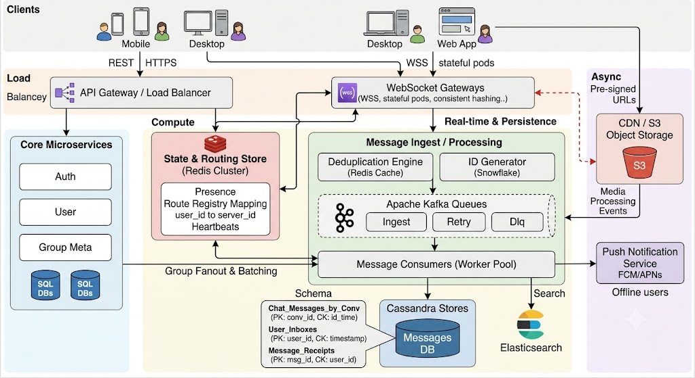

# WhatsApp

## Requirement

### Functional Requirement

- One to One Chat & Group Chat
- Online Presence & Read Receipt
- Message Sync/Push Notification for offline users
- Media

### Non-Functional Requirement

1. CAP Theroem
   - Eventua Consistency for message order & online presence
2. Messages never lost, atleast once, ordering

## Core Entities & APIs

### Core Entities

### APIs

- Websocket for real time communication
- rest for non-instant requirements

## High Level Design

1. Messages : Cassandra where pk = conversation_id (max(u1, u2) + min(u1, u2))
2. Inbox : Cassandra where pk = user_id, ck = lasttimestamp
3. Message Recepit : Cassandra where pk = message and ck = userid
4. Group Meta data : SQL

## Deep Dive

1. Realtime transport : Socket
2. Delivery Gurantee : persist before ack, retry, server should give time for message, client buffers and order message
3. Scaling stateful server : Consistent Hashing
4. Group Fanout : for >500 user implement fanout and batching

## 

### Correction

Missing Components & Architectural FixesPresence & Connection Registry: WebSockets are stateful. You need a distributed Redis Key-Value Store mapping user_id -> server_id (for routing messages to active socket instances) and managing Heartbeats/TTL for Online Presence.Distributed Message Queue (Kafka): Ingests incoming chat payloads, decouples WebSocket gateways from persistence layer, handles retry queues, and powers asynchronous worker tasks. Push Notification Service (FCM/APNs): Triggers when Redis presence lookup returns offline or socket connection drops. Media Processing Pipeline: S3 Object Storage + CDN for media delivery. Clients upload encrypted media directly to S3 via pre-signed URLs, sending only the media_url payload through WebSockets. Deduplication Engine: A Redis idempotency key cache ($client\_msg\_id \to server\_msg\_id$) to prevent duplicate processing on client retries.
