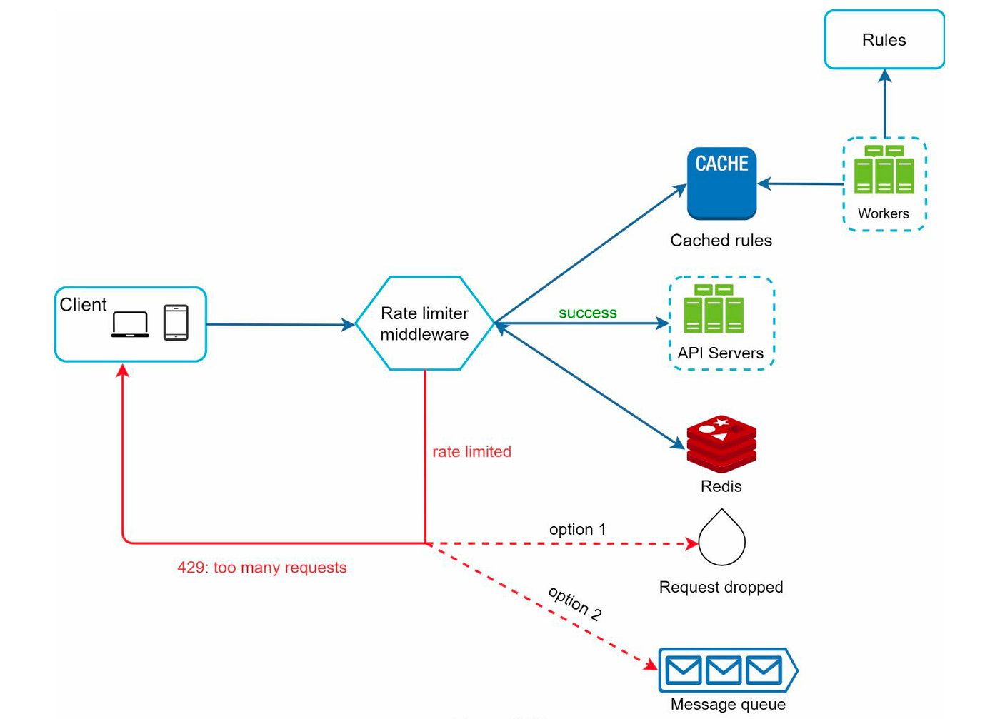

# Rate Limiter

## Requirement

### Functional Requirement

### Non-Functional Requirement

1. CAP Theroem
2. Low Latency

## Core Entities & APIs

### Core Entities

### APIs

## High Level Design

- where to place rate limiter

## Deep Dive

- rate limiter in distributed environment
  - Race Condition : Locks (Slower) -> Redis + Lua Script
  - Synchronoization : Sticky Session (No Flexiblity & Scale) -> centralised data store
- Performance Optimization
  - Muli data center setup
  - Eventual Consistency on limits
- Monitoring

## 

## Links

- <https://medium.com/geekculture/system-design-design-a-rate-limiter-81d200c9d392>
- <https://github.com/wuyichen24/system-design-interview/blob/master/problems/support/Rate_Limiter.md>
- <https://itnext.io/rate-limiting-system-design-algorithms-trade-offs-and-best-practices-c6019cb2dd85>
