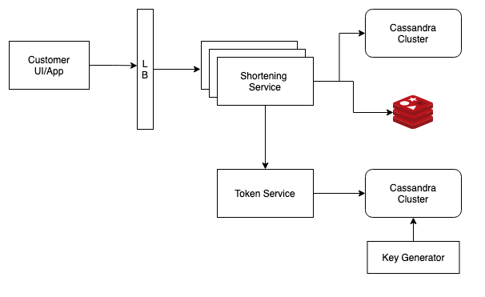

# URL Shortener

## Requirement

### Functional Requirement

- create short url (expiry+url)
- redirect to orginal url

### Non-Functional Requirement

1. CAP Theroem
   1. high availability, eventual consistency on redirection working
2. Low Latency
   1. low latency redirect
3. Ensure short uniqueness
4. Scale 100M DAU & 1B URL

## Core Entities & APIs

### Core Entities

- URL : shortUrl, LongUrl

### APIs

- shortenUrl(longUrl)
- redirect(shortUrl)

## High Level Design

- DB : NoSql to handle billion urls
- 302 direct (temporaty redirect)
- 301 direct (permanent redirect based on cache) - use if don't need analtics

## Deep Dive

1. Unique Url Creation
   1. AP1 : prefix of long url
   2. AP2 : Random number generato
      - we need 1 Billion URL which is 10^9 (more collision in shorter space)
      - base 62 encoding(0-9, A-z,a-z)
      - 62^6 = 56 Billion have more space and less collsion since 1Billion in 56 Billion
   3. AP3 : hash(base62)
   4. Bijective Function
2. Low lateny on redirect
   1. Indexing : Btree has logn and hash index has constant time complexity
   2. Cache/CDN
3. High Availability
   1. Redis High Availability mode
   2. DB Replica
4. Scaling
   1. Horizontal Scaling
   2. Auto Scaling
   3. shard by short url

## 

## Links

- <https://www.systemdesignhandbook.com/guides/tinyurl-system-design/>
- <https://tripathi-abhinav.medium.com/url-shortener-system-design-tinyurl-system-design-e2abc224feb3>
