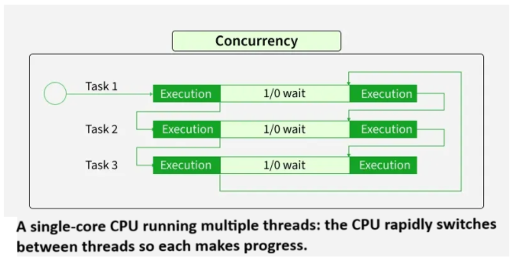
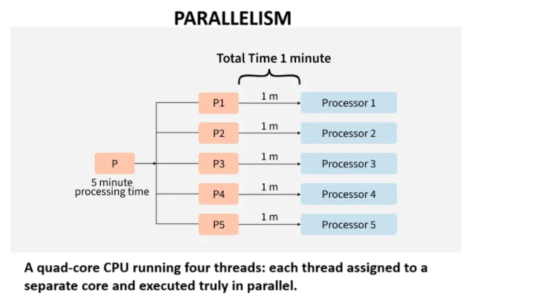

# Mulithreading

- [Thread Basics](#thread-basics)
  - [Thread States](#thread-states)
    - [NEW](#new)
    - [RUNNABLE](#runnable)
    - [BLOCKED](#blocked)
    - [WAITING](#waiting)
    - [TIMED_WAITING](#timed-waiting)
    - [TERMINATED](#terminated)
  - [run() vs start()](#run-vs-start)
  - [Thread Priority](#thread-priority)
  - [Daemon Thread](#daemon-thread)
  - [ThreadLocal](#threadlocal)
- [Synchronization & Locks](#synchronization--locks)
  - [Race Condition](#race-condition)
  - [synchronized](#synchronized)
  - [Intrinsic Locks & Object Monitors](#intrinsic-locks--object-monitors)
  - [Reentrancy](#reentrancy)
  - [Atomicity](#atomicity)
  - [Visibility](#visibility)
  - [Happens-Before Relationship](#happens-before-relationship)
  - [Java Memory Model](#java-memory-model)
- [Thread Coordination](#thread-coordination)
  - [wait()](#wait)
  - [notify()](#notify)
  - [notifyAll()](#notifyall)
  - [Spurious Wakeups](#spurious-wakeups)
  - [sleep() vs wait()](#sleep-vs-wait)
  - [join() vs yield()](#join-vs-yield)
  - [Condition](#condition)
- [Concurrency Problems](#concurrency-problems)
  - [Deadlock](#deadlock)
    - [Coffman's Conditions](#coffmans-conditions)
  - [Starvation](#starvation)
  - [Livelock](#livelock)
  - [Thread Safety](#thread-safety)
- [Java Locks](#java-locks)
  - [ReentrantLock](#reentrantlock)
  - [ReentrantReadWriteLock](#reentrantreadwritelock)
  - [Condition](#condition-1)
  - [Lock vs synchronized](#lock-vs-synchronized)
- [Synchronization Utilities](#synchronization-utilities)
  - [Semaphore](#semaphore)
  - [CountDownLatch](#countdownlatch)
  - [CyclicBarrier](#cyclicbarrier)
  - [Phaser](#phaser)
  - [Exchanger](#exchanger)
- [Atomic & Lock-Free Programming](#atomic--lock-free-programming)
  - [AtomicInteger](#atomicinteger)
  - [AtomicLong](#atomiclong)
  - [AtomicReference](#atomicreference)
  - [CAS](#cas)
  - [compareAndSet()](#compareandset)
  - [volatile + CAS](#volatile--cas)
  - [ABA Problem](#aba-problem)
- [Executor Framework](#executor-framework)
  - [Executor](#executor)
  - [ExecutorService](#executorservice)
  - [ThreadPoolExecutor](#threadpoolexecutor)
    - [Core Pool Size](#core-pool-size)
    - [Maximum Pool Size](#maximum-pool-size)
    - [Work Queue](#work-queue)
    - [Keep Alive](#keep-alive)
    - [Rejection Policies](#rejection-policies)
  - [FixedThreadPool](#fixedthreadpool)
  - [CachedThreadPool](#cachedthreadpool)
  - [ScheduledExecutorService](#scheduledexecutorservice)
  - [shutdown() vs shutdownNow()](#shutdown-vs-shutdownnow)
- [Callable & Future](#callable--future)
  - [Runnable vs Callable](#runnable-vs-callable)
  - [Future](#future)
  - [CompletableFuture](#completablefuture)
    - [thenApply()](#thenapply)
    - [thenCompose()](#thencompose)
    - [thenCombine()](#thencombine)
    - [exceptionally()](#exceptionally)
    - [allOf() vs anyOf()](#allof-vs-anyof)
- [ForkJoin Framework](#forkjoin-framework)
  - [ForkJoinPool](#forkjoinpool)
  - [Work Stealing](#work-stealing)
  - [RecursiveTask](#recursivetask)
  - [RecursiveAction](#recursiveaction)
- [Modern Java Concurrency](#modern-java-concurrency)
  - [Virtual Threads](#virtual-threads)
  - [Platform Threads vs Virtual Threads](#platform-threads-vs-virtual-threads)
  - [Executors.newVirtualThreadPerTaskExecutor()](#executorsnewvirtualthreadpertaskexecutor)
  - [Virtual Thread Pinning](#virtual-thread-pinning)
  - [When NOT to Use Virtual Threads](#when-not-to-use-virtual-threads)

## Concurrency & Parallelism

### Concurrency (Structure of Program)

- Concurrency is the ability of a system to handle multiple tasks during overlapping time periods not at same time.
- Concurrency means **structuring** a program so that multiple tasks
  can make progress. The tasks might not execute simultaneously, but the **program is
  organized to handle them in an interleaved fashion.**
- Concurrency — one CPU, multiple tasks in progress.
- **Benefits** : Better Resource Utilization, High Responsiveness since not holding on single task, Increase throughput for I/O bound workloads naturally with single cpu, increase for CPU-bound workloads with parallelism(multiple CPU)
- Challenges:
  - Non-Determinism : A concurrent program has **multiple possible execution orders.** Different execution order can produce different results, even with identical inputs. This non-determinism makes concurrent programs hard to reason about.The bug might appear once in a thousand runs, only in production, only under load.
  - Race Conditions : A race condition **happens when non-determinism leads to an incorrect outcome**. It specifically occurs when two or more threads access shared memory concurrently, at least one of those accesses is a write, and there is no proper synchronization (like locks or mutexes) to enforce order.
  - Deadlocks : A deadlock occurs when two or more threads are **waiting for each other for a lock**, and none can proceed. Deadlocks don't corrupt data like race conditions. Instead, the **program simply stops making progress**. In production, this often manifests as a service becoming unresponsive under load.
  - Debugging Difficulty : Concurrent bugs are **notoriously hard to find** because:
    - They are **intermittent**: The bug only appears under specific timing conditions.
    - Observation changes behavior: Adding print statements or attaching a debugger changes timing, potentially making the bug disappear.
    - This is called a "heisenbug," a bug that seems to disappear when you try to observe it (named after Heisenberg's uncertainty principle).
  - Complexity : Even without bugs, concurrent code is**harder to understand than sequential code** since You need to think about:
    - What data is shared between threads?
    - What synchronization protects that data?
    - What happens if thread A runs before thread B? What about the reverse?
    - Can these operations be reordered by the compiler or CPU?

  - This mental overhead increases the cognitive load on developers and reviewers.

Non-Determinism & Race Condition

They are closely related, but they are not the same thing. **Non-determinism is a broad concept, while a race condition is a specific defect.**

- **Non-Determinism (The Nature of Concurrency):** This is a neutral characteristic of concurrent systems. It simply means that given the exact same input, a program can take different execution paths or timing orders because of thread scheduling, network latency, or hardware state. Non-determinism isn't inherently a bug—a correctly synchronized concurrent program can be non-deterministic in its thread execution order while still reliably producing the correct answer every single time.
- **Race Condition (The Bug):** This is an actual flaw in the program's logic. A race condition happens when non-determinism leads to an incorrect outcome. It specifically occurs when two or more threads access shared memory concurrently, at least one of those accesses is a write, and there is no proper synchronization (like locks or mutexes) to enforce order.

**Summary**
Non-determinism creates the unpredictable environment in which race conditions can hide. Non-determinism is the **behavior**; a race condition is the **bug** that happens when that behavior causes your program to fail.

### Parallelism (Hardware Configuration)

- Using multiple CPUs (or cores), multiple tasks literally executing at the same instant. Task A runs on Core 1 while Task B runs on Core 2 simultaneously.
- Parallelism is about execution. It's multiple tasks literally running at the same instant on different processors or cores.

### Concurrency Vs Parallelism

- parallelism implies concurrency, but **concurrency doesn't require parallelism**. If two tasks run in parallel, their time windows obviously overlap (concurrent). But concurrent tasks don't need multiple cores — a single core switching between them is enough.
- A program can be concurrent without running in parallel but A **program cannot run in parallel unless it's structured to be concurrent**. Parallelism requires multiple independent tasks, which means the program must first have concurrent structure**otherwise one gaint task running on one of the core even 4 cores available.**

### Rob Pike's Definition

- Concurrency is about dealing with lots of things at once. Parallelism is about doing lots of things at once.
  - You can write a concurrent program that never runs in parallel (single core).
  - You cannot write a parallel program that isn't concurrent (you need multiple tasks to parallelize).

### Core Relationship

> > Concurrency is necessary for parallelism, but not sufficient.( Need H/w )

- To get parallelism, you need concurrency plus hardware (multiple cores/CPUs).

- "Necessary" — You can't run things in parallel if your code isn't even structured for multiple tasks. You need concurrency first.

- "Not sufficient" — Just because your code can juggle multiple tasks doesn't mean the hardware will run them simultaneously. A single-core machine will still interleave them.

**So: concurrency = the design. Parallelism = the execution. You need the right design, but you also need the right hardware. Design alone isn't enough — that's why it's not sufficient.**
So just because I have multiple core CPU, my code will be not be parallelized (code need to be concurrent)

### Common Misconceptions

- Misconception 1: "Concurrent means parallel"
  - Not quite. A concurrent program can run on a single core, where tasks are interleaved but never truly run parallel.
- Misconception 2: "Adding more threads always helps"
  - More threads do not automatically mean more speed.
  - For CPU-bound work on a 4-core machine, running far more than 4 active threads often just **increases context-switching and scheduling overhead.**
  - **For I/O-bound workloads, extra threads can help hide waiting time**, but adding threads helps up to a point, **but infinite threads won't give infinite speedup** beacuse memory limit and context switching overhead.
- Misconception 3: "Parallel is always faster"
  - Not necessarily. Parallelism has overhead:
    - Thread creation and management
    - Synchronization and communication
    - Cache coherency traffic
    - Amdahl's Law limits
  - For **small tasks, that overhead can outweigh the benefit**. In some cases, the fastest solution is the simplest one: run it sequentially.

### Designing for Concurrency

1. Identify Independent Tasks - the more independent the tasks are, the more parallelism you can unlock.
2. Minimize Shared State - Every synchronization point becomes a bottleneck that serializes execution and reduces parallelism.
   - Shared, mutable state forces you to add synchronization (locks, atomic operations, coordination)
3. Use Appropriate Granularity - Task size matters.
   - If tasks are too small, overhead (scheduling, context switches, coordination) can outweigh the benefit.
   - If tasks are too large, you cannot distribute work evenly, and some workers sit idle.

### Consider the Workload Type

Different workloads benefit from different approaches.

| Workload      | Strategy                                                    |
| :------------ | :---------------------------------------------------------- |
| **I/O-bound** | Concurrency matters most; async often helps                 |
| **CPU-bound** | Parallelism matters most; scale up to core count            |
| **Mixed**     | Split into I/O and CPU phases, and optimize each separately |

## Thread Vs Process

## Thread Basics

## Synchronization & Locks

## Thread Coordination

## Happens-Before Relationship

## Concurrency Problems

## Java Locks

## Synchronization Utilities

## Atomic & Lock-Free Programming

## Callable & Future

## ForkJoin Framework

## Modern Java Concurrency

- partial ordering on instruction since concurrent we cannot do total ordering
- <https://web.goodnotes.com/s/NGiA9uSx4H4YE7FArjqVvN>
- physical notes
  <https://www.logicbig.com/tutorials/core-java-tutorial/java-multi-threading/happens-before.html>
