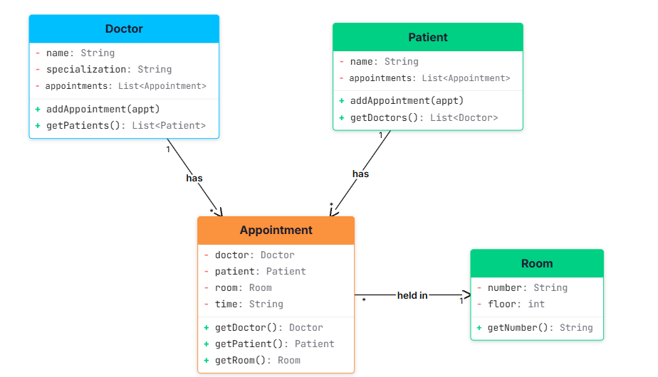
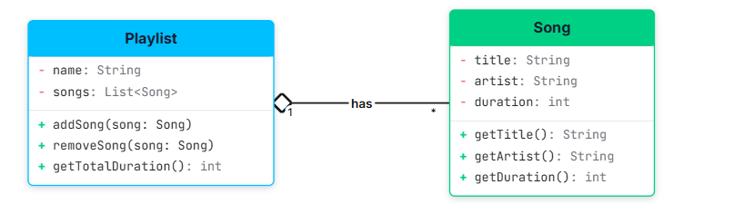
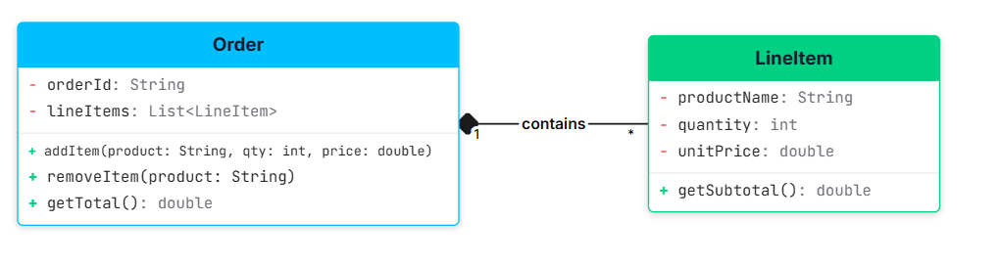
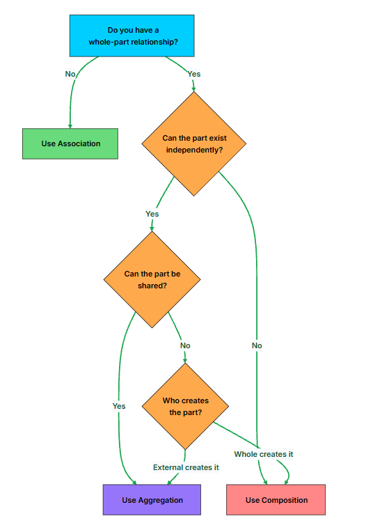

### Class Relationships

- In the real world, nothing exists in isolation.
  A doctor has patients.
  A driver has a car.
  A student enrolls in courses.
- our goal is to model this real world where objects**communicate and work together to achieve meaningful outcomes.**

> > Garbage Collection/fk in sql based thinking helps to understand ownership.

### Association

- Association represents a relationship between two classes where **one object uses, communicates with, or references another.**
  `Student * -- learns from -->(1..*) Teacher`
- A student has a teacher who teaches them.
- A teacher teaches multiple students.
- However:
- A student can still exist without a teacher.
- A teacher can still exist without any specific student.
- This is a real-world association:
- The relationship exists.
- But neither party owns the other.
- Their lifecycles are independent.
- **Association**

- Reflects a "has-a" or "uses-a" relationship.
- Objects are loosely coupled and can exist independently of one another.
- Can be unidirectional or bidirectional, and can follow different multiplicity patterns (1-to-1, 1-to-many, etc.).

**Types of Association**

- Associations between classes can vary depending on **how objects are connected** and in **which direction information flows.**
- Associations are primarily defined by two key properties:
- Directionality — Who knows about whom?
- Multiplicity — How many objects are connected?

1. **Based on Direction (Directionality)** — Determines which class holds a reference to the other and whether communication is one-way or two-way.
   1. **Unidirectional Association:** Only one class is aware of or holds a reference to the other class. The referenced class has no knowledge of who is referencing it. E.g., `Order` holds a reference to `PaymentGateway` and calls its method, but `PaymentGateway` has no field or reference pointing back to `Order`.
   2. **Bidirectional Association:** Both classes are aware of each other. Each class holds a reference to the other, enabling two-way communication. A `Team` has a list of `Developer`s, and each `Developer` knows which `Team` they belong to. Either side can navigate to the other.
   3. In a bidirectional association, both references must stay in sync, otherwise state becomes inconsistent.

      ```java
      class Developer {
          private Team team;

          public void setTeam(Team team) {
              this.team = team;
          }
      }

      class Team {
          private List<Developer> developers = new ArrayList<>();

          public void addDeveloper(Developer dev) {
              // updates both sides of the relationship
              developers.add(dev);
              dev.setTeam(this);
          }
      }

      ```

2. **Based on Multiplicity**
   - Multiplicity defines how many instances of one class can be associated with instances of another class.
   - It describes the quantity and nature of the connections.

   a. **One-to-One Association**
   Each object of one class is linked to exactly one object of the other class.
   `User (1) -- Profile (1)`

   Why you would split this data into two classes (and database tables) instead of putting everything into a single class called `User`:
   - **Single Responsibility:** A `User` class focuses strictly on authentication and security logic (e.g., verifying passwords, logging in, checking user permissions).
   - **Separation of Details:** A `Profile` class handles presentation and customization details (e.g., profile pictures, personal bios, UI preferences).
   - **Maintainability & Security:** You don't clutter security code with profile customizers. If you need to update how user preferences work, you only edit `Profile` without risking breaking the core login/authentication code in `User`.

   - If you find that two one-to-one associated classes are always created, modified, and deleted together with no independent use case, that's a signal they might belong as a single class instead.

   b. **One-to-Many Association**
   One object of a class is linked to multiple objects of another class. `Project (1) -- Issue (*)`

   Example: Each Project can have many Issues (bug reports, feature requests), but each Issue belongs to one Project. The project holds a list of issues, and each issue holds a back-reference to its project.

   [reference](./misc.md/#one-to-many-bounded-context)

   c. **Many-to-Many Association**
   Multiple objects from one class are associated with multiple objects from another class. This is common in scenarios involving **memberships, enrollments, or tagging systems.** `User (*) -- Group (*)`

   Example: A User can be a **member of multiple Groups** (WhatsApp groups, Slack channels), and a **Group can have multiple Users**. Both sides hold a list of the other. The joinGroup() and addUser() methods keep both sides in sync.

   Many-to-many associations are inherently bidirectional and require careful synchronization. In database design, you'd model this with a **join table**. In code, both sides hold a list of the other, and you need helper methods that update both sides atomically.
   <!-- markdownlint-disable MD033 -->
   <details>
     <summary>code</summary>

   ```java
   class User {
       private String name;
       private List<Group> groups = new ArrayList<>();

       public void joinGroup(Group group) {
           if (!groups.contains(group)) {
               groups.add(group);
               group.addUser(this);
           }
       }
   }

   class Group {
       private String name;
       private List<User> users = new ArrayList<>();

       public void addUser(User user) {
           if (!users.contains(user)) {
               users.add(user);
               user.joinGroup(this);
           }
       }
   }

   // Usage
   User alice = new User("Alice");
   User bob = new User("Bob");

   Group backend = new Group("Backend");
   Group devOps = new Group("DevOps");

   alice.joinGroup(backend);
   alice.joinGroup(devOps);
   bob.joinGroup(backend);

   // Alice is in: Backend, DevOps
   // Bob is in: Backend
   // Backend has: Alice, Bob
   // DevOps has: Alice
   ```

   Notice the guard clause in both joinGroup() and addUser(). Without it, calling alice.joinGroup(backend) would add backend to Alice's groups, then backend.addUser(alice) would add Alice to backend's users, then it would call alice.joinGroup(backend) again, and you'd be stuck in an infinite loop. The contains check breaks the recursion.

   ```java
   public void joinGroup(Group group) {
    this.groups.add(group);
    //real word
    group.getUsers().add(this); // Directly mutate collection, don't call group.addUser(this)
    }
   ```

</details>

## 

**Why This Design Works**

1. **The Appointment class is the intermediary.** Instead of Doctor and Patient holding direct references to each other (which would create a tangled many-to-many), they connect through Appointment. This is a common pattern for modeling many-to-many relationships in code, **analogous to a join table** in a relational database.
2. Navigation works both ways. A doctor can find all their patients by walking their **appointments**. A patient can find all their doctors the same way. **Neither class needs to maintain a separate list of the other.**
3. Room stays simple. The room doesn't need to know about appointments. It's just a location. **This keeps the relationship unidirectional and avoids unnecessary coupling.**
4. Adding data to the relationship is natural. Because Appointment is a full object, you can add fields like time, status, notes, or diagnosis without modifying Doctor or Patient. Try doing that with a direct many-to-many reference.

---

### Aggregation

- Aggregation is a specialized form of association that models a **whole-part relationship with loose ownership.**

- One class (the "whole") contains references to other class objects (the "parts"), but the **parts can exist independently of the whole.**

- It's often described as a "has-a" relationship where the **whole does not control the part's lifecycle.**
- The key distinction from plain association is the structural hierarchy: there's a clear container and contained, not just two objects that know about each other.
- The whole does not create or destroy the part.
- The part can be **shared** among multiple wholes.
- Both the whole and the part can be **created and destroyed independently.**

> If a class contains other classes for logical grouping only without lifecycle ownership, it is an aggregation.

```java
public class Main {
    public static void main(String[] args) {
        Professor p1 = new Professor("Dr. Smith");
        Professor p2 = new Professor("Dr. Johnson");

        List<Professor> profs = List.of(p1, p2);

        Department csDept = new Department("Computer Science", profs);
        csDept.printProfessors();

        // csDept can be deleted or go out of scope...
        // but p1 and p2 still exist and can be used elsewhere.
    }
}
```

## 

**The diagram shows two classes connected by aggregation:**

- Playlist holds references to multiple Song objects. The **1 to \* multiplicity means one playlist can group many songs.**
- Song is an independent entity with its own data (title, artist, duration). It **doesn't know which playlists reference it.**
- The **hollow diamond (o--) on the Playlist side** is the UML notation for aggregation. It **signals that Playlist is the "whole" and Song is the "part,**" but the songs are not owned by the playlist.

---

### Composition

- Composition is a special type of **association** that signifies strong ownership between objects.

**Key Characteristics of Composition:**

1. Represents a strong “has-a” relationship.
2. The whole owns the part and controls its lifecycle.
3. When the whole is destroyed, the parts are also destroyed.
4. The parts are not shared with any other object.
5. The**part has no independent meaning or identity outside the whole.**

> > If the part makes no sense without the whole, use composition.

## 

Pay attention to three things that make this composition:

1. The **order creates its own line items.** The addItem() method takes raw data (product name, quantity, price) and internally creates a new LineItem(...). The line items are not passed in from outside. This is the key structural difference from aggregation, where parts are created externally and passed into the whole.

2. Line items have no independent existence. There is**no LineItem floating around in the system outside of an Order**. No other class holds a reference to these line items. They are born inside the order and die with the order.

3. Destroying the order destroys all line items. W**hen the Order object is garbage collected (or goes out of scope in C++), all its LineItem objects are destroyed too.**No orphaned line items, no cleanup code, no dangling references.

This is a true composition relationship: the parts exist only within the context of the whole, and their lifecycle is completely controlled by it.

> > Composition is a preferred alternative to inheritance when building flexible systems.

Why?

- You can build complex behavior by composing smaller, reusable parts.
  It avoids the tight coupling and fragility of inheritance hierarchies.
- You can swap out parts dynamically to modify behavior.
  For example:
- A Vehicle can compose an Engine interface.
  Swap between PetrolEngine, ElectricEngine, or HybridEngine at runtime.
- This leads to cleaner, testable, and decoupled code.

### Composition vs Aggregation vs Association

- Association is a general connection: two classes simply know about each other.
- Aggregation is a grouping: the whole and parts can exist independently.
- Composition is an ownership: the part’s existence is bound to the whole.

## 
